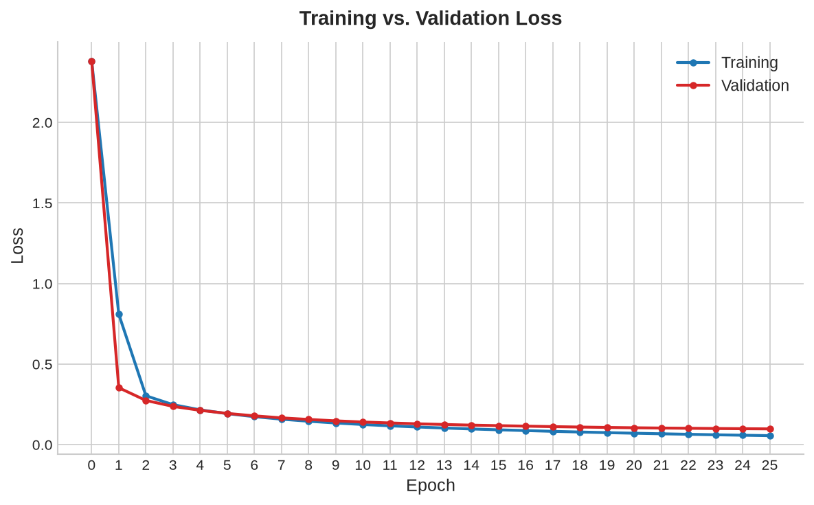
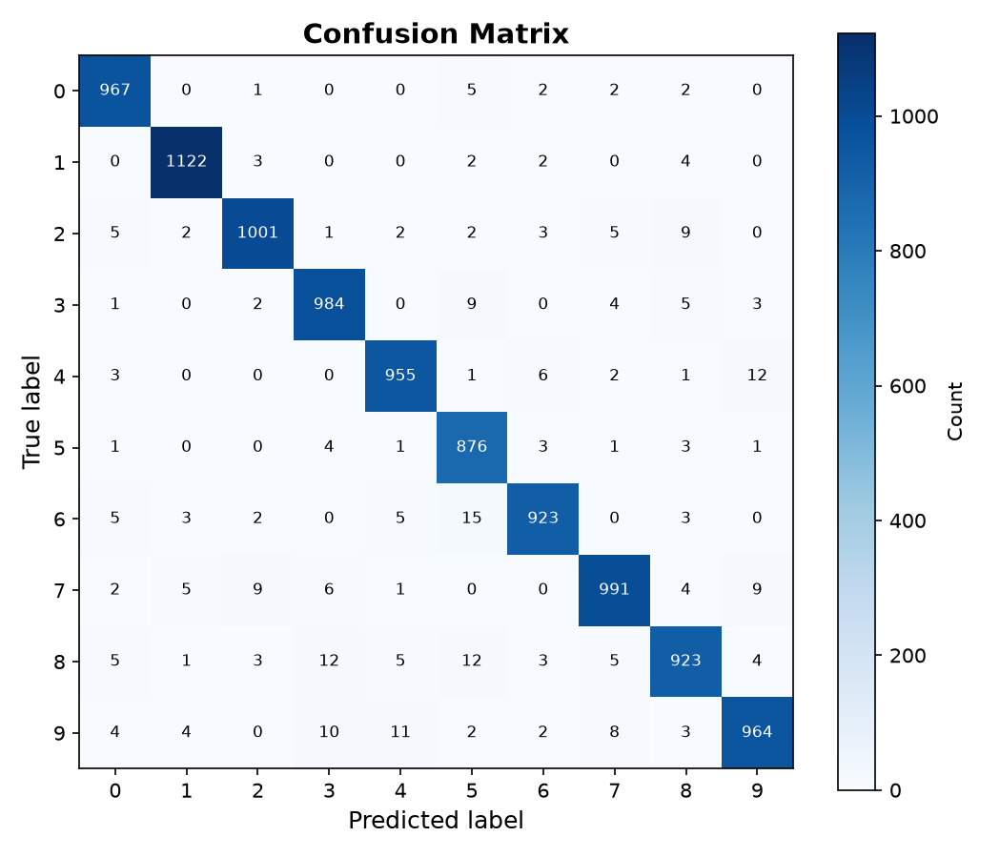

# Neural Network From Scratch (NumPy)

A fully connected neural network implemented entirely from scratch using only NumPy.

This project demonstrates how modern neural networks work internally by implementing every major component manually—from forward propagation and backpropagation to gradient descent and cross-entropy loss—without relying on machine learning frameworks such as TensorFlow, PyTorch, or Keras.

The network is trained on the MNIST handwritten digit dataset and achieves 97.22% test accuracy, demonstrating that a carefully implemented neural network can reach high performance using only fundamental linear algebra and calculus.

## Overview
Deep learning libraries hide enormous amounts of complexity behind a few lines of code.

Instead of calling:
```bash
model.fit(...)
```
this project implements every important algorithm manually, including:

* Dense (Fully Connected) Layers
* ReLU Activation
* Softmax
* Cross Entropy Loss
* Backpropagation
* Gradient Descent
* He Weight Initialization
* Mini-Batch Training
* Data Loading
* One-Hot Encoding

The objective was not to build the fastest neural network, but to understand how neural networks actually learn internally.

## Features
* Pure NumPy implementation
* No machine learning frameworks
* Mini-batch gradient descent
* Fully vectorized operations
* He initialization
* Numerically stable Softmax
* Cross Entropy Loss
* Modular layer design
* Object-oriented architecture
* Training and validation monitoring
* Confusion Matrix visualization
* Loss curve visualization

## Project Structure
```bash
Neural-Network-From-Scratch
│
├── data
│   ├── mnist_train.csv
│   └── mnist_test.csv
│
├── src
│   ├── data.py
│   ├── network.py
│   ├── model.py
│   └── train.py
│
├── results
│   ├── LossGraph.png
│   └── ConfusionMatrix.png
│
├── requirements.txt
└── README.md
```

## Neural Network Architecture

The implemented model is a fully connected feed-forward neural network.

```bash
Input (784)
↓
Linear (784 → 128)
↓
ReLU
↓
Linear (128 → 64)
↓
ReLU
↓
Linear (64 → 32)
↓
ReLU
↓
Linear (32 → 10)
↓
Softmax (inside CrossEntropyLoss)
```

Input images are 28×28 grayscale pixels, flattened into vectors of 784 features.

The output layer predicts probabilities for the 10 digit classes (0–9).

## How the Code Works

### 1. Data Loading
data.py streams the MNIST dataset directly from CSV files.

Each image:

* is normalized to [0,1]
* converted into a NumPy array
* grouped into mini-batches
* labels are one-hot encoded

Using generators allows the project to process the dataset without loading everything into memory at once

### 2. Model Definition

model.py builds the network by stacking layers.
Changing the architecture only requires modifying this list.

### 3. Forward Pass
Each batch flows sequentially through every layer.

For a dense layer:

```bash
Output = Inputs.Weights + Bias
```

Each ReLU applies

```bash
Output = max(0,x)
```

The final layer outputs raw logits, not probabilities.

### 4. Loss Computation

The project combines:

* Softmax
* Cross Entropy

into a single class.

This avoids explicitly computing the Softmax Jacobian and provides a numerically stable implementation.

Loss:

```bash
L= −∑Label.log(Prediction)
```

Gradient:

```bash
∂z/∂L = Prediction − Label
```

### 5. Backpropagation

Gradients flow backwards through every layer.

For each dense layer:

1. Compute weight gradients
2. Compute bias gradients
3. Update parameters

Parameter updates use vanilla Gradient Descent:

```bash
  Weight = Weight − (Learning Rate * ∇W)
```

### 6. Training Loop

During every epoch:

```bash
For each mini-batch
↓
Forward Pass
↓
Compute Loss
↓
Backpropagation
↓
Update Weights
↓
Repeat
```

After every epoch the model evaluates the validation dataset.

## Results

Test Accuracy: 97.22%
This demonstrates that even a relatively small fully connected neural network can achieve excellent performance on MNIST when implemented correctly.

Macro F1 Score: 0.9718
The macro F1 score indicates that performance remains consistently strong across all classes rather than being dominated by only the easiest digits.

| Digit | Precision | Recall |     F1 |
| ----- | --------: | -----: | -----: |
| 0     |    0.9738 | 0.9877 | 0.9807 |
| 1     |    0.9868 | 0.9903 | 0.9885 |
| 2     |    0.9804 | 0.9718 | 0.9761 |
| 3     |    0.9676 | 0.9762 | 0.9719 |
| 4     |    0.9745 | 0.9745 | 0.9745 |
| 5     |    0.9481 | 0.9843 | 0.9658 |
| 6     |    0.9778 | 0.9655 | 0.9716 |
| 7     |    0.9735 | 0.9649 | 0.9692 |
| 8     |    0.9645 | 0.9486 | 0.9565 |
| 9     |    0.9708 | 0.9563 | 0.9635 |

## Training Curve



## Confusion Matrix



## Installation

Clone the repository:

```bash
git clone https://github.com/yourusername/neural-network-from-scratch.git

cd neural-network-from-scratch
```

Install dependencies:

```bash
pip install -r requirements.txt
```

## What I Learned

This project provided hands-on experience implementing the core algorithms behind deep learning, including:

* Matrix multiplication for neural networks
* Forward propagation
* Backpropagation
* Gradient descent optimization
* Stable Softmax implementation
* Cross-entropy loss
* Weight initialization strategies
* Mini-batch training
* Modular neural network design
* Performance evaluation using precision, recall, F1 score, and confusion matrices

Building each component from first principles reinforced the mathematical foundations of neural networks and provided a much deeper understanding of how frameworks such as PyTorch and TensorFlow operate internally.

## Future Improvements

Potential extensions to this project include:

* Implementing additional optimizers (Momentum, RMSProp, Adam)
* Adding Batch Normalization
* Introducing Dropout regularization
* Supporting configurable activation functions (Leaky ReLU, GELU, ELU)
* Implementing Convolutional Neural Network (CNN) layers
* Saving and loading trained weights
* GPU acceleration through CuPy
* Automatic gradient checking
* Learning rate schedulers
* Experiment configuration via YAML/JSON